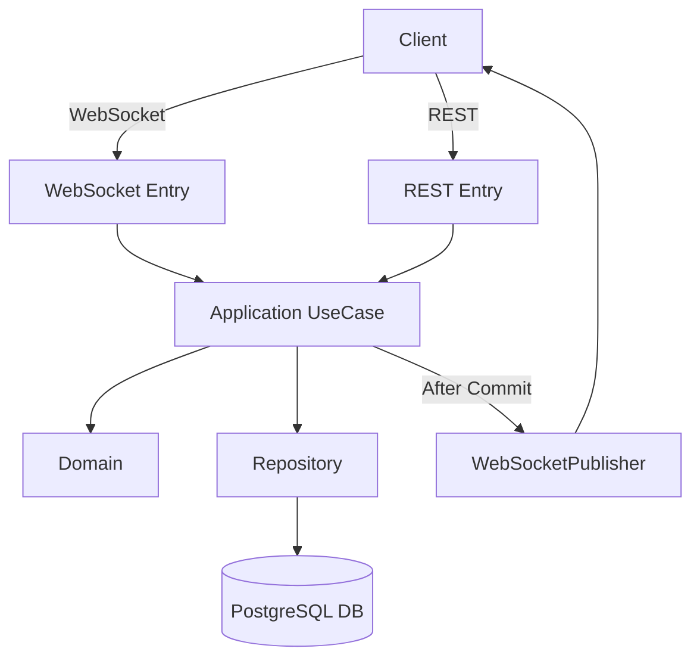
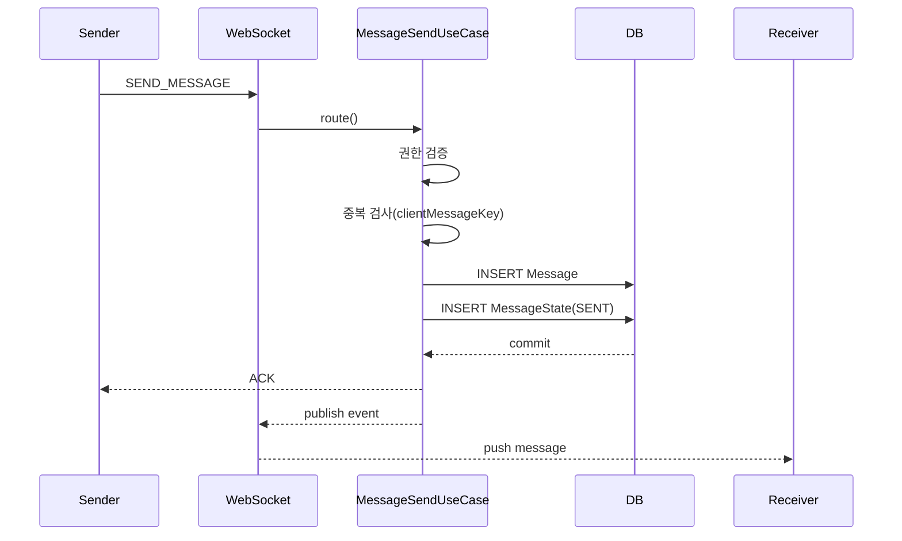
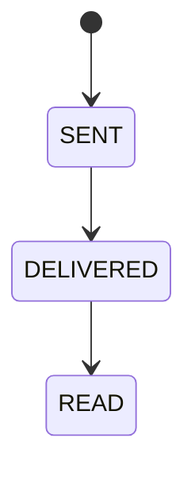
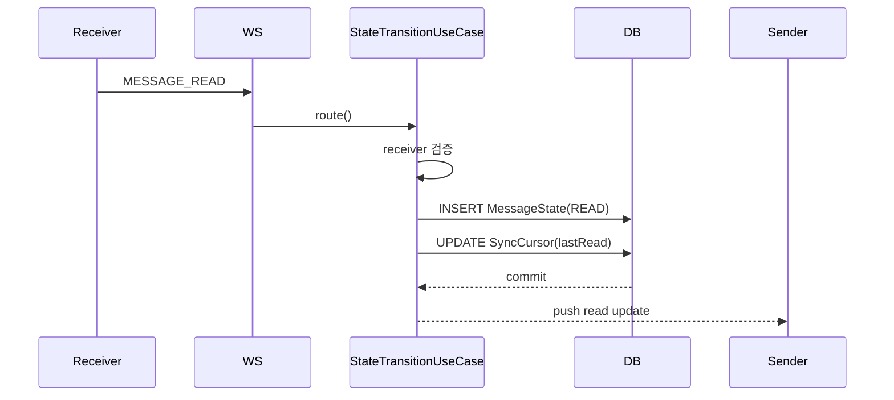
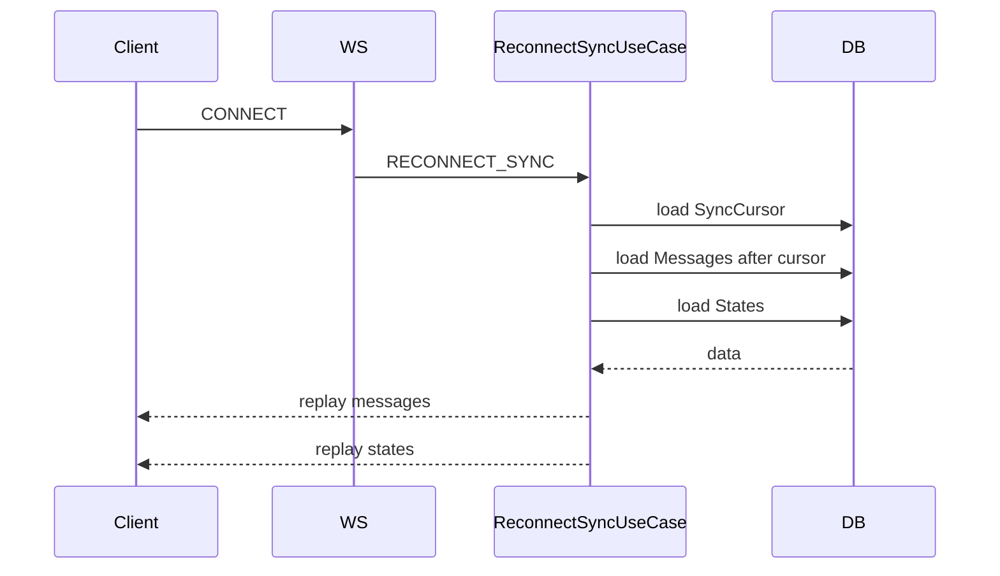
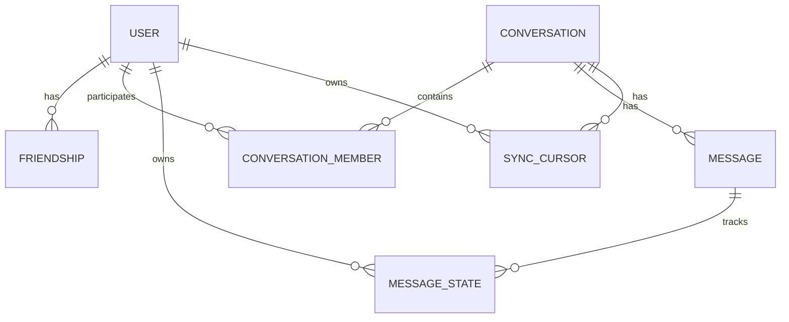

# Signal_Project
개인 프로젝트(포트폴리오용)

1. Project Overview

Signal은 WebSocket 기반의 실시간 메신저 서버입니다.
단순한 채팅 기능 구현이 아니라, 메시지 전달의 신뢰성과 상태 동기화의 정합성을 핵심 가치로 설계했습니다.

이 프로젝트는 다음 질문에 답할 수 있도록 설계되었습니다:

 - 네트워크가 끊기면 메시지는 어떻게 복구되는가?
 - 중복 전송은 어떻게 처리되는가?
 - 읽음 상태는 어떻게 일관성을 유지하는가?
 - 서버 재시작 이후에도 데이터는 안전한가?

Signal은 이러한 문제를 **DB 중심 설계(DB = Source of Truth)**와
append-only 메시지 구조, cursor 기반 동기화 전략을 통해 해결합니다.

2. Core Features

 - WebSocket 기반 실시간 메시지 전송
 - 메시지 영속성 보장 (append-only)
 - 메시지 상태 관리 (SENT / DELIVERED / READ)
 - 재접속 시 메시지 및 상태 동기화
 - 읽음 인원 숫자 기반 집계
 - 멱등성 보장 (clientMessageKey 기반)

3️. System Architecture

Signal은 다음 아키텍처 원칙을 따릅니다:

 - DB is the Source of Truth
   - WebSocket 연결 상태나 클라이언트 상태를 신뢰하지 않습니다.
   - 모든 판단은 DB에 저장된 데이터 기준으로 수행됩니다.

 - Entry Layer는 I/O만 담당
   - WebSocket과 REST Controller는 요청을 수신하고 Application 계층으로 전달하는 역할만 수행합니다.
   - 비즈니스 판단은 Application(UseCase) 계층에서만 수행됩니다.

 - Domain은 불변 개념만 정의
   - Domain 계층은 개념과 구조만 정의하며 정책이나 조건 판단은 포함하지 않습니다.

4️. Message Delivery Flow

◇ Message Delivery Strategy

메시지 전송은 다음 순서를 따릅니다:

 - 권한 검증 (Conversation 참여 여부, Friendship 상태 확인)
 - 멱등성 검증 (clientMessageKey 기반 중복 확인)
 - Message INSERT (append-only)
 - MessageState(SENT) INSERT
 - 트랜잭션 커밋
 - AFTER_COMMIT 이후 WebSocket push

설계 의도

 - 메시지는 절대 UPDATE하지 않습니다.
 - DB 저장 성공이 곧 메시지 존재의 기준입니다.
 - Push 실패 시 재접속 동기화를 통해 복구 가능합니다.

5️. Read & Delivery State Design

◇ 상태를 Message와 분리한 이유

 - 메시지 상태는 Message 엔티티에 포함하지 않고 독립된 MessageState 테이블로 관리합니다.

이렇게 설계한 이유는:

 - append-only 구조 유지
 - 상태 전이 단조 증가 보장
 - 그룹 채팅에서 사용자별 상태 추적 가능
 - 감사 및 디버깅 가능성 확보

◇ Read Count 설계 전략

 - 읽음 숫자는 MessageState COUNT가 아닌 SyncCursor 기반으로 계산합니다.

이유

 - 사용자별 읽음 진행 상태는 Conversation 단위로 관리
 - read_count는 “cursor 이상을 읽은 사용자 수”로 계산
 - 대규모 그룹에서도 확장 가능
 - 이 설계는 정합성을 유지하면서도 성능 최적화 여지를 남깁니다.

6️. Reconnection & Synchronization Strategy

◇ Cursor 기반 동기화

 - 재접속 시 클라이언트가 보낸 커서는 참고 정보일 뿐이며, 항상 DB에 저장된 SyncCursor가 우선합니다.

동기화 과정:

 - DB 기준 cursor 조회
 - cursor 이후 메시지 조회
 - 상태 정보 조회
 - 클라이언트에 재전송

이 방식은:

 - 네트워크 장애
 - 서버 재시작
 - WebSocket push 실패

상황에서도 메시지 유실 없이 복구 가능합니다.

7️. Data Model (설계 의도 중심)

 ◇ append-only 메시지 구조

 - messages 테이블은 UPDATE를 수행하지 않습니다.
 - 모든 메시지는 INSERT만 수행됩니다.

이 구조는:

 - 이벤트 기반 추적 가능
 - 감사 가능성 확보
 - 정합성 유지에 유리

◇ MessageState 분리 설계

Message × User 단위로 상태를 관리합니다.

 - SENT
 - DELIVERED
 - READ

상태 전이는 단조 증가만 허용합니다.

◇  SyncCursor 설계

SyncCursor는 User × Conversation 단위로 존재합니다.

 - lastDeliveredMessageId
 - lastReadMessageId

읽음 숫자 계산 및 재접속 복구의 핵심 엔티티입니다.

8️⃣ Design Decisions & Trade-offs

OFFSET 페이징을 사용하지 않은 이유:

 - OFFSET 기반 페이징은 대규모 데이터에서 성능 문제가 발생합니다.
 - Signal은 message_id 기반 커서 페이징을 사용합니다.

WebSocket 연결 상태를 신뢰하지 않는 이유:

 - WebSocket은 언제든 끊길 수 있습니다.
 - 연결 여부를 상태 기준으로 사용하면 정합성이 깨질 수 있습니다.

read_count를 컬럼으로 두지 않은 이유:

 - read_count를 Message에 저장하면 append-only 원칙과 충돌하며 동시성 문제가 발생할 수 있습니다.

따라서 cursor 기반 동적 계산 방식을 채택했습니다.

9️⃣ Limitations & Future Improvements

 - 대규모 그룹에서 read_count 캐시 최적화 가능
 - Redis Pub/Sub 확장 가능
 - Transactional Outbox 패턴 적용 가능
 - 파티셔닝 전략 도입 가능

## System Architecture

## Message Delivery Sequence Diagram

## State Transition Diagram

## READ Sequence

## Reconnect & Sync Diagram

## ERD Diagram

