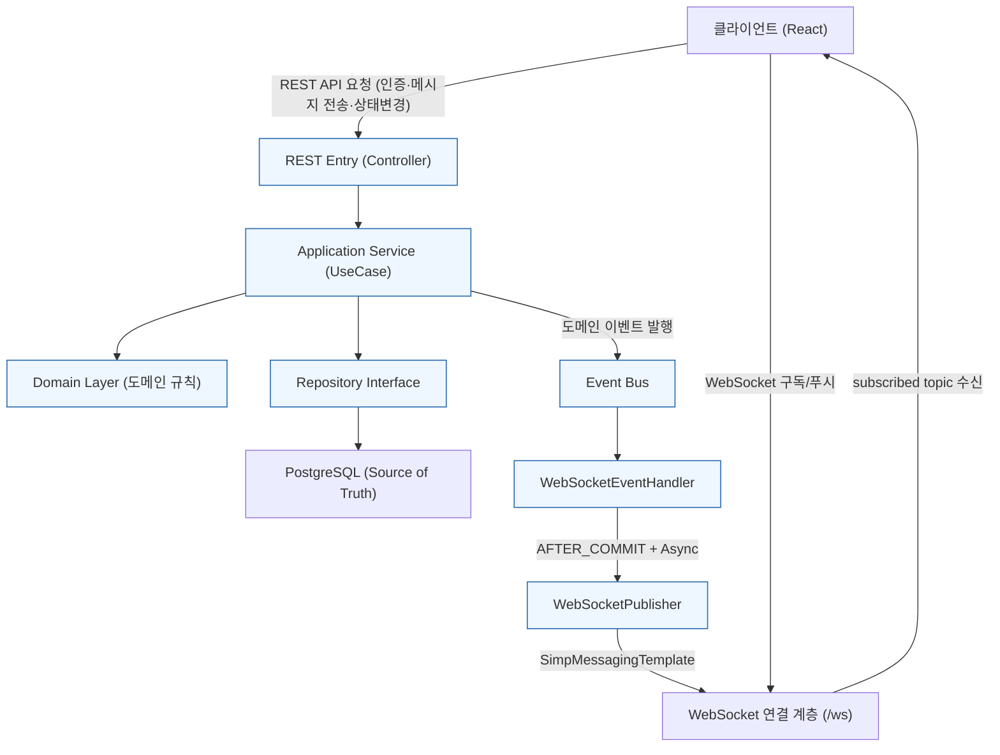
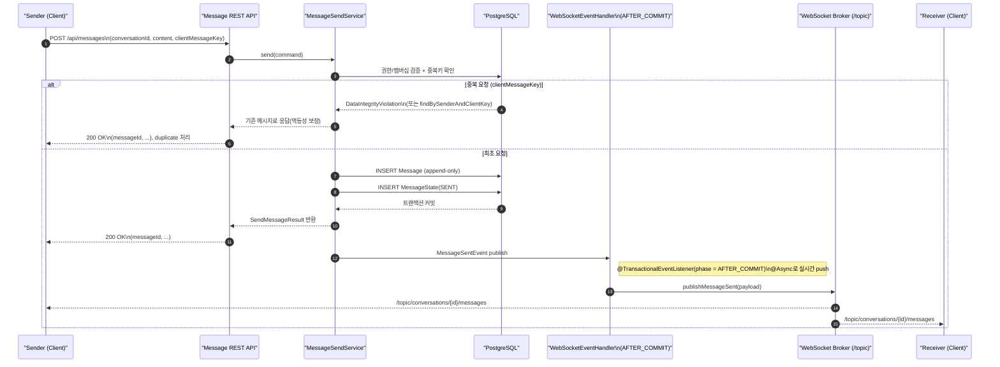
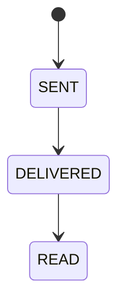
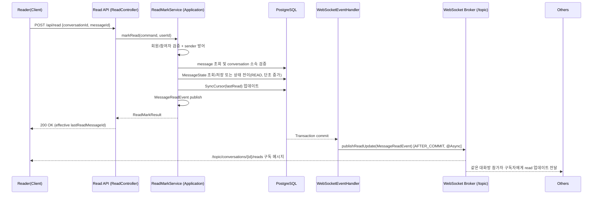
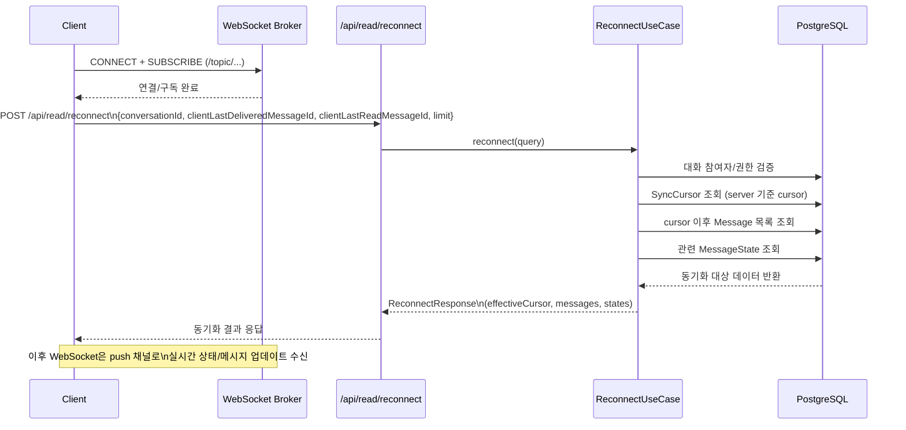
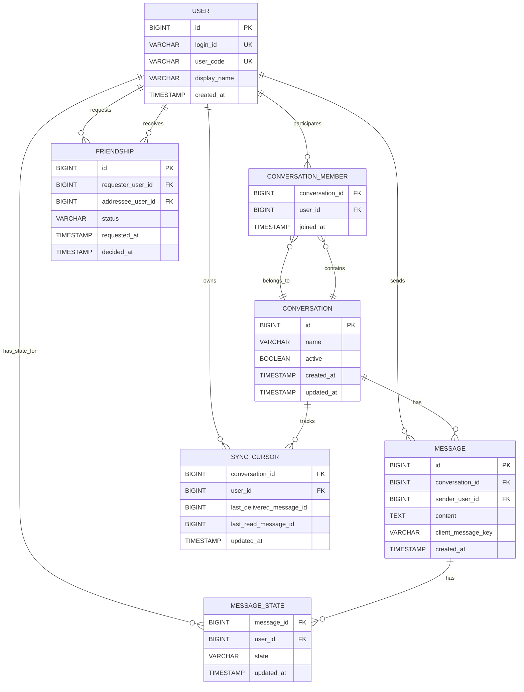

# Signal

Signal은 WebSocket 기반의 실시간 메신저 서버입니다.  
단순히 채팅 기능을 구현하는 데서 그치지 않고, **메시지가 실제로 전달되었는지**, 그리고 **상태가 일관되게 유지되는지**를 가장 중요한 기준으로 두고 설계했습니다.

포트폴리오 프로젝트로 시작했지만, 구현 과정에서는 실제 서비스 환경을 가정했습니다. 네트워크 단절이나 중복 전송, 재접속 상황은 물론이고 서버 재기동 이후에도 문제없이 복구될 수 있을지를 계속 점검하며 구조를 다듬었습니다.

---

## 프로젝트 구성

- Backend: `SignalProject_Spring`  
- Frontend: `SignalProject_Frontend`

---

## 핵심 목표

이 프로젝트를 설계할 때 스스로에게 가장 많이 던졌던 질문은 “끊겨도 안전한가?”였습니다. 그 기준 아래 다음 네 가지를 핵심 목표로 삼았습니다.

1. 메시지 손실 최소화  
2. 중복 전송 제거(멱등성 보장)  
3. 읽음/전달 상태의 일관성 유지  
4. 단절·재시작 이후에도 복구 가능한 동기화 구조 확보  

---

## 핵심 기능 (MVP)

1. 사용자 인증/인가  
   - 회원가입, 로그인, 토큰 기반 API 호출

2. 친구 관계  
   - 친구 코드 생성 및 요청/수락

3. 실시간 채팅  
   - 채팅방 입장 및 메시지 송수신

4. 메시지 상태 관리  
   - SENT / DELIVERED / READ 상태 추적

5. 재접속 동기화  
   - 커서 기반 누락 메시지 복구

6. 안읽음 수 집계  
   - 참가자별 cursor 기반 계산

---

## 아키텍처 설계 원칙

### 1) DB is the Source of Truth

처음에는 WebSocket 연결 상태를 기준으로 처리하는 구조도 고민했습니다.  
하지만 연결은 언제든 끊길 수 있다는 점에서 신뢰하기 어렵다고 판단했고, 최종적으로는 **모든 판단 기준을 DB에 두는 방향**으로 설계를 정리했습니다.

- 메시지 존재 여부  
- 상태 전이  
- 동기화 기준  

모두 DB 값을 기준으로 결정합니다.

---

### 2) 책임 분리(레이어 분리)

역할이 섞이기 시작하면 장애 상황에서 원인을 추적하기 어려워진다는 점을 경험적으로 느꼈습니다. 그래서 각 레이어의 책임을 비교적 명확하게 나눴습니다.

- Controller / WebSocket Handler: 입출력 처리  
- Application Service: 정책 판단 및 유스케이스 수행  
- Domain: 핵심 개념과 불변 규칙  
- Repository: 영속성 접근

---

### 3) 불변성 중심 메시징

메시지를 수정 가능한 데이터로 다루기보다는 “기록”으로 보는 편이 더 안전하다고 판단했습니다.

- 메시지 본문은 append-only `INSERT` 기반으로 유지  
- 상태 변화는 별도 엔티티로 관리  

그 결과, 그룹 채팅에서도 사용자별 상태 추적이 자연스러워졌고, 디버깅 시에도 흐름을 따라가기가 훨씬 수월해졌습니다.

---

## Message Delivery Flow

1. 권한 검증  
   - 대화방 참여 여부 및 관계 정책 확인  

2. 멱등성 검증  
   - `clientMessageKey` 기준 중복 전송 차단  

3. 메시지 저장  
   - `Message` append-only `INSERT`  

4. 초기 상태 저장  
   - `MessageState`에 SENT 기록  

5. 트랜잭션 커밋  

6. 커밋 이후 WebSocket push (AFTER_COMMIT)

### 설계 의도

메시지는 반드시 DB에 먼저 기록되어야 전달 대상으로 인정됩니다.  
WebSocket push는 실패할 수 있다는 전제를 두었고, 실제로 실패하더라도 재접속 동기화를 통해 복구할 수 있도록 설계했습니다.

---

## 메시지 상태 및 정합성 설계

### 상태를 분리한 이유

- 메시지는 append-only로 유지  
- 상태는 사용자 단위로 관리  
- 그룹 채팅 대응 용이  
- 감사 및 디버깅 용이

### 상태 전이

SENT → DELIVERED → READ (단조 증가)

### 읽음 수 계산

처음에는 메시지에 `read_count`를 누적 저장하는 방식도 검토했습니다.  
하지만 동시성과 정합성 측면에서 부담이 크다고 판단해, 현재는 cursor 기반으로 동적으로 계산하는 방식을 선택했습니다.

- `SyncCursor` (User × Conversation) 기반  
- 확장성과 일관성 확보

---

## Reconnection & Synchronization

재접속 시 클라이언트 커서를 그대로 신뢰하지 않습니다.  
항상 DB의 서버 기준 커서를 먼저 조회한 뒤 동기화를 진행합니다.

1. 서버 기준 `SyncCursor` 조회  
2. cursor 이후 메시지 조회  
3. 상태 정보 재조회  
4. 클라이언트 동기화 전송  

이 방식은 네트워크 단절, push 실패, 서버 재시작 상황에서도 안정적으로 동작합니다.

---

## Data Model (요약)

- `messages` (append-only)  
- `message_states` (Message × User 상태)  
- `sync_cursors` (User × Conversation 기준 커서)  
- `users`, `friendships`, `conversations`, `conversation_members`

---

## 구현 상태

### Implemented

- 사용자 인증 플로우  
- 친구 요청/수락 및 코드 기반 연결  
- 실시간 메시지 송수신  
- 멱등성 키 기반 중복 전송 방지  
- 메시지 상태 추적  
- 재접속 동기화(커서 기준)

### Planned / Improving

- 대규모 대화방 성능 최적화  
- 이미지/파일 첨부 확장  
- Redis Pub/Sub 도입  
- Transactional Outbox 패턴 적용

---

## Design Trade-off

- OFFSET 대신 cursor 기반 조회 선택  
  → 대용량 메시지 환경에서 성능 저하 방지  

- WebSocket 온라인 상태 미사용  
  → 연결 상태는 신뢰 가능한 기준이 아니라고 판단  

- 메시지에 read_count 미저장  
  → 동시성 충돌 및 append-only 원칙 충돌 방지  

---

## 한계 (Limitations)

- 대규모 그룹 읽음 집계는 추가 최적화 여지 존재  
- push 지연 가능 (재접속 동기화로 보정)  
- 영상통화/미디어 전송/푸시 알림은 향후 확장 예정  

## System Architecture

## Message Delivery Sequence Diagram

## State Transition Diagram

## READ Sequence

## Reconnect & Sync Diagram

## ERD Diagram

